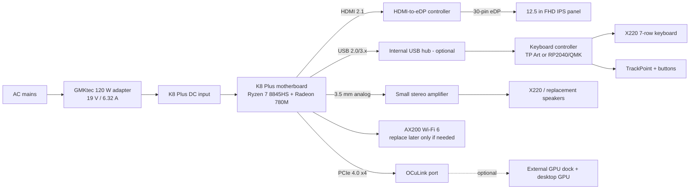

# System Architecture

## V0/V1 architecture

## Physical design philosophy

The donor board does **not** need to line up with original X220 ports. The board is positioned for:

1. cooler and fan clearance;
2. keyboard underside clearance;
3. hinge clearance;
4. display-cable routing;
5. SSD/RAM serviceability.

External ports are then exposed through one of three methods:

- direct cutout when a donor port naturally reaches the side wall;
- short high-quality panel-mount extension;
- future side daughterboard/carrier arrangement.

## Version boundaries

### V0 — bench / ugly-but-working
- Stock donor adapter.
- Donor cooler untouched.
- HDMI-to-eDP display board.
- USB keyboard controller.
- No battery.
- Cables can be externally visible.

### V1 — integrated laptop
- Custom PETG/PA chassis.
- Internal display controller.
- Proper fan duct.
- Clean port cutouts/extensions.
- Internal speakers.
- Serviceable RAM/SSD access.

### V2 — electrical refinement
- Custom carrier/controller PCB.
- Better status LEDs / power button handling.
- Possible battery power after dedicated review.
- Optional OCuLink docking workflow.
