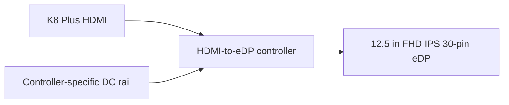

# Display System

## V0 choice

Use a **12.5-inch 1920×1080 IPS 30-pin eDP panel** with a universal HDMI-to-eDP controller.

## Why HDMI-to-eDP first

- easy to debug on a bench;
- K8 has a known HDMI output;
- inexpensive controller boards are locally available;
- isolates the display problem from USB4/DP-alt-mode quirks.

A later revision can investigate a cleaner DP/eDP solution.

## Mechanical compatibility references

A historical X220/X230 FHD mod guide documented compatible 12.5-inch panels including:

- LG LP125WF2-SPB3;
- LG LP125WF2-SPB4;
- AUO B125HAN02.0;
- BOE NV125FHM-N62.

The guide also notes that panel connector position and physical mounting matter; some trimming/routing may be needed.

## Local availability snapshot

Indonesian 12.5-inch FHD 30-pin panels for X250/X260/X270/X280-class laptops were found around **Rp735k–1.25m** during the 2026-09-12 research pass. A reasonable project budget is **Rp850k–1.1m**.

Universal HDMI-to-eDP 30-pin controller boards were around **Rp320k–360k**.

## Purchase checklist

Before ordering a panel:

- [ ] 1920×1080.
- [ ] IPS preferred.
- [ ] 30-pin eDP, **not LVDS**.
- [ ] Non-touch unless intentionally designing for touch.
- [ ] Check connector position against cable routing.
- [ ] Check mounting ears / screw pattern / panel thickness.
- [ ] Ask seller for the exact panel model, not just "compatible".

## Controller-board warning

Universal controller boards vary. Verify the **actual purchased board's input voltage, polarity, panel firmware/resolution support, and connector pinout** before connecting power. Do not infer this from another seller's board that looks similar.
