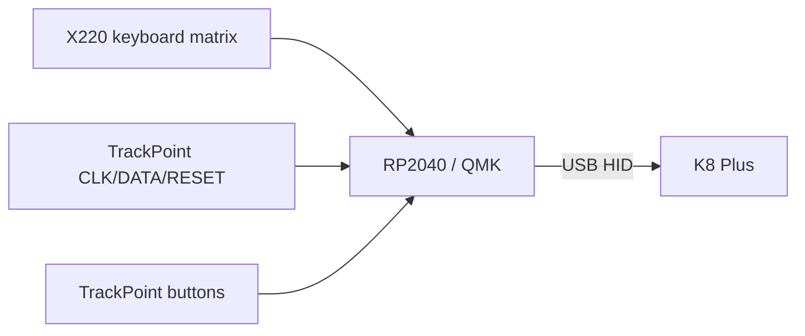

# Keyboard + TrackPoint

## Fast path: TP Art controller

TP Art sells a USB controller for classic ThinkPad keyboards at **US$59** and explicitly lists the X220 family. It supports TrackPoint and at least some Fn/media combinations.

Use this path if the priority is getting a working laptop quickly.

## DIY path: RP2040 + QMK

Community work has already documented the X220 keyboard connector and matrix. One reverse-engineering source records a **16 drive × 8 sense** keyboard matrix and separate TrackPoint PS/2-style signals.

A practical DIY architecture:

### Relevant documented X220 connector signals

Community pinout work identifies signals including:
- keyboard drive/sense lines;
- `-PWRSWITCH`;
- mute/mic/caps/power LED lines;
- 3.3 V / 5 V rails;
- TrackPoint `DATA`, `CLK`, and `RESET`.

Use the linked source as reference, then verify the actual keyboard/connector revision with continuity testing.

## RP2040 board caveat

A small RP2040 Zero is physically attractive, but not every dev board exposes enough GPIO for a direct no-expander implementation. Options:

1. use a PCB with the bare RP2040 / sufficient GPIO;
2. add I/O expanders for matrix scanning;
3. use an existing proven controller design;
4. start with TP Art and replace it later.

## Recommended development sequence

1. Do **not** start by making the final carrier PCB.
2. Get keyboard + TrackPoint working on a desk.
3. Log exact connector part number and orientation.
4. Confirm Linux key mapping.
5. Confirm TrackPoint movement + all three buttons.
6. Add LEDs / ThinkLight / power-key features later.

## Current local MCU price

RP2040 Zero boards were found around **Rp40k–110k** depending on seller/originality. Budget Rp80k–100k for a known-source board.
