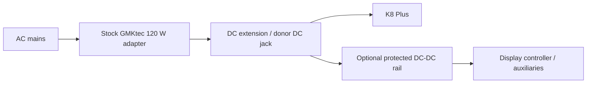

# Power and Battery

## Verified donor requirement

The K8 Plus is specified with a **19 V / 6.32 A, 120 W DC adapter**.

This is the only power-input path assumed safe for V0.

## V0 power architecture

The display controller may need a different rail. Select the DC-DC converter **after the actual controller input requirement is confirmed**.

## Do not assume USB-C input

The K8 Plus specification lists USB4 with PD capability, but the verified system power input is the dedicated 19 V DC jack. Do not design V0 around powering the computer from USB-C.

## Original X220 batteries

Lenovo documented:

| Pack | Nominal voltage | Energy |
|---|---:|---:|
| 44 | 14.4 V | 44 Wh |
| 44+ | 11.1 V | 63 Wh |
| 44++ | 11.1 V | 94 Wh |

These voltages are **not** a direct match for a regulated 19 V input. Original smart-pack charging/communication also makes reuse a separate engineering problem.

## Battery phase rules

Battery integration is **blocked** until all are true:

- V0 has passed prolonged CPU/GPU load testing;
- typical and peak wall power have been measured;
- required runtime is defined;
- internal battery volume is measured;
- candidate power converter is tested on an electronic load or equivalent;
- charging, BMS, fusing, cell protection and thermal behaviour have a written design.

## Safer development path

For early portable testing, evaluate a **commercial certified high-power external battery solution** plus a correctly engineered regulated 19 V conversion path. Do not place loose hobby lithium cells inside the chassis as a shortcut.

## Import pricing note

For ordinary imported goods between FOB US$3 and US$1,500, Indonesian Customs currently describes a general **7.5% import duty** and effective **11% VAT** treatment, with exceptions by commodity. Shipping and customs valuation can affect the actual amount. See `reference/Sources.md`.
