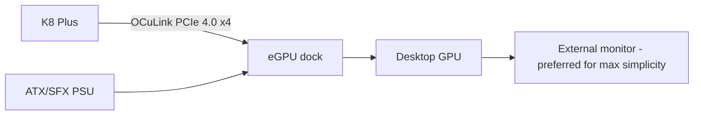

# OCuLink eGPU

## Why external instead of internal dGPU

An internal discrete GPU would force a completely different thermal, battery and motherboard architecture. The K8 Plus already gives Radeon 780M graphics for mobile use and exposes **PCIe 4.0 ×4 through OCuLink** for desk use.

## Architecture

## Operational rule

**Power off before plugging or unplugging OCuLink.** GMKtec states the port is not hot-pluggable.

## Indonesia price snapshot

Search results during the research pass showed:

- simple eGPU mounting hardware from ~Rp258k;
- Minisforum DEG1-class OCuLink docks around ~Rp1.65m–2.4m;
- some ADT/AOOSTAR-class docks around ~Rp2.4m–3.6m+;
- PSU and GPU are additional.

This is a future upgrade and should not be in the V0 budget.
